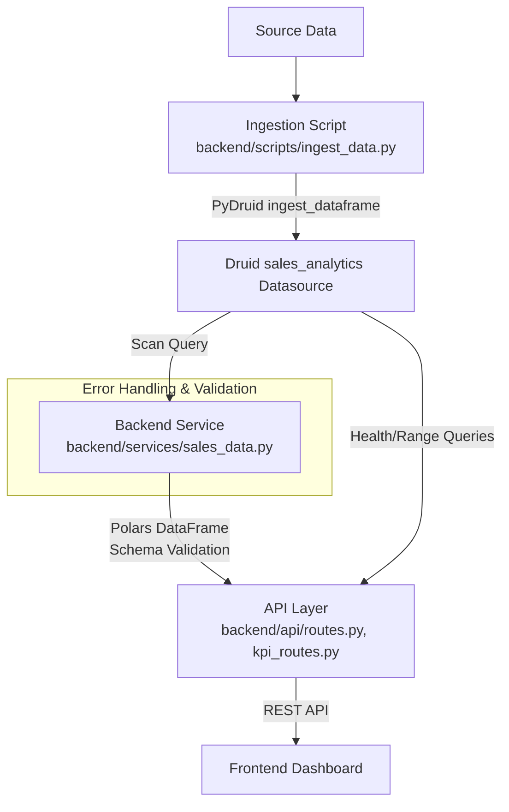

# Druid Pipeline: Detailed Review and Data Flow

## 1. Druid Ingestion Spec Review

The ingestion process is defined in `backend/scripts/ingest_data.py` using PyDruid’s `ingest_dataframe` method. Key points:

- **Source**: Reads from a CSV file (`../../sales_data.csv`).
- **Time Handling**: Converts the `__time` column to datetime objects for Druid.
- **Dimensions**: 
  - ProductLine
  - ItemGroup
  - Branch
  - SalesPerson
  - AcctName
  - ItemName
  - CardName
- **Metrics**:
  - grossRevenue (doublesum)
  - returnsValue (doublesum)
  - unitsSold (doublesum)
  - unitsReturned (doublesum)
  - totalCost (doublesum)
  - lineItemCount (longsum)
- **Granularity**: Segment granularity is set to 'day', query granularity is 'none'.
- **Intervals**: Covers a wide range (1900-01-01/2100-01-01).

**Note:** The ingestion script does not currently include explicit error handling for failed ingestions or data validation before ingesting. Consider adding try/except blocks and logging for production robustness.

## 2. Pipeline Robustness: Error Handling & Data Completeness

- **Schema Validation**: The backend uses `pandera.polars` to validate dataframes against the `sales_analytics_schema` (see `backend/models/sales_analytics_schema.py`). If the schema or validation library is missing, a warning is logged and validation is skipped.
- **Error Handling**: 
  - Custom `DataQualityError` is defined for data quality issues.
  - Logging is configured for info and error messages.
  - API endpoints and data fetching functions use try/except blocks and log errors.
  - Druid connection is checked at startup and via `/api/health/druid`.
- **Data Completeness**: 
  - The ingestion script assumes the CSV contains all required fields. No explicit null/missing value checks are present in the script.
  - Backend fetch functions filter and validate data, but completeness checks (e.g., for missing days or outliers) would need to be added if required.

## 3. Data Flow Diagram

## 4. Data Flow Summary

1. **Source Data**: Sales data is prepared in a CSV file with all required fields.
2. **Ingestion**: The script reads the CSV, converts time columns, and ingests the data into Druid using PyDruid, specifying dimensions and metrics.
3. **Druid Storage**: Data is stored in the `sales_analytics` datasource, partitioned by day.
4. **Backend Fetching**: The backend queries Druid using scan queries, applies filters, and validates the results against the schema.
5. **API Layer**: Data is exposed via REST API endpoints, with health checks and error handling.
6. **Frontend**: The dashboard fetches and visualizes the data for end users.

**Recommendations:**
- Add error handling and logging to the ingestion script for production use.
- Consider adding data completeness checks (e.g., for missing/null values) before ingestion.
- Ensure schema validation is always enabled in the backend for data quality.
- Monitor Druid health and ingestion job status regularly.
  